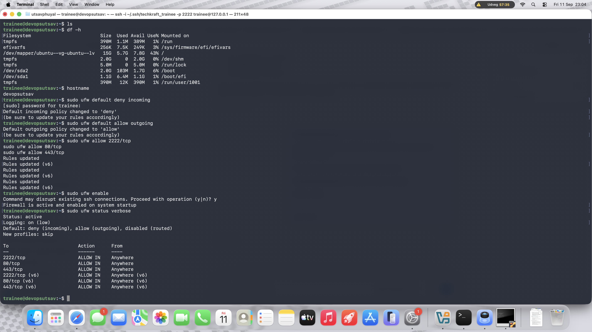
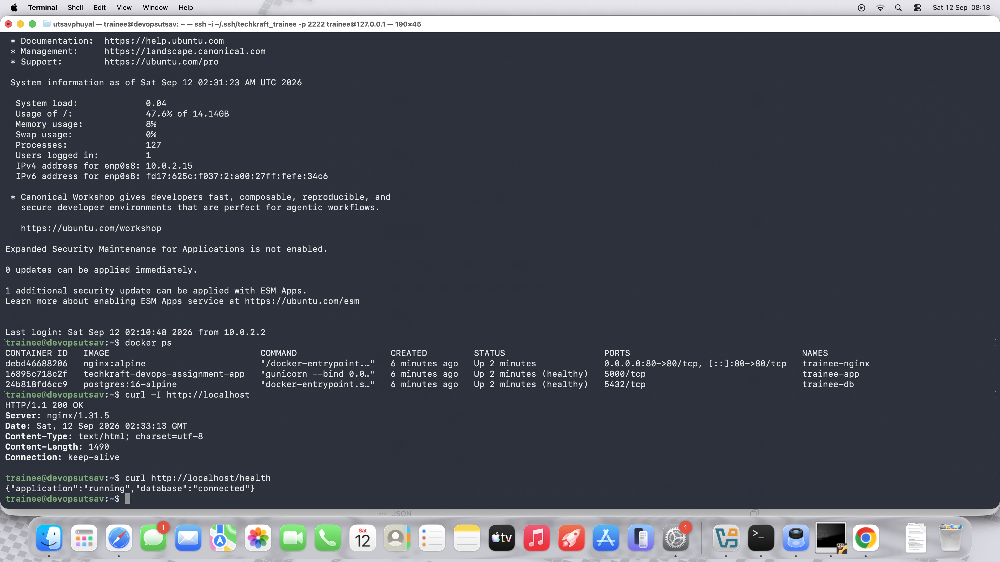
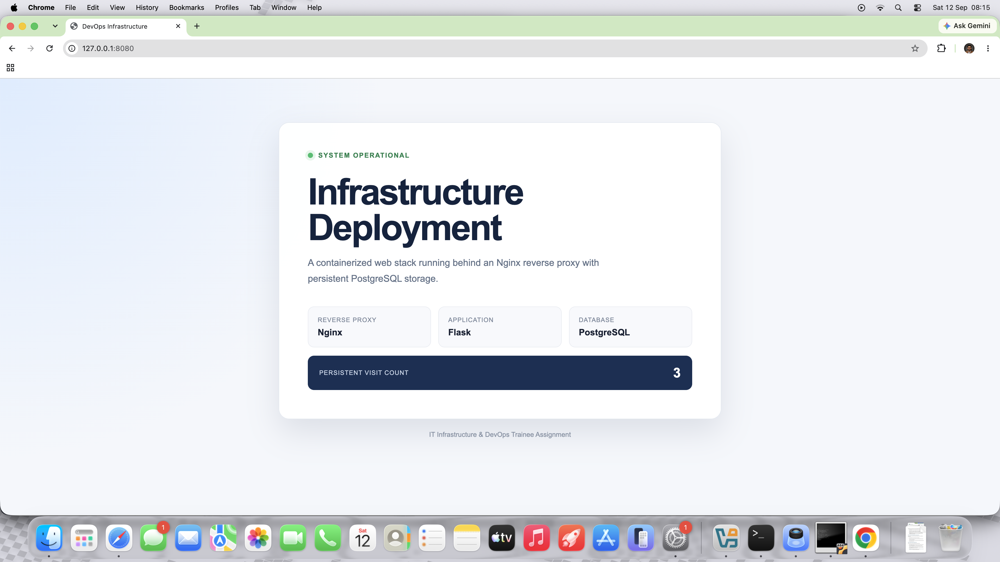
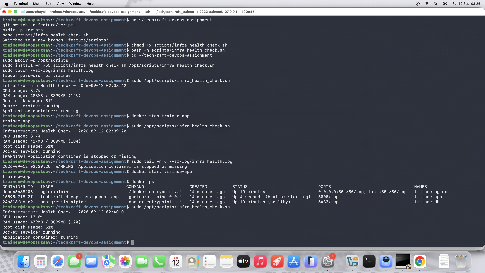

# IT Infrastructure and DevOps Trainee Assignment

This repository contains my implementation of the TechKraft DevOps trainee assignment. I built and tested it on Ubuntu Server 24.04 ARM64 running in VirtualBox on my Apple Silicon Mac.

## What I built

The project contains:

* An Ubuntu user named `trainee` with sudo access
* SSH key authentication on port 2222
* UFW rules for ports 2222, 80 and 443
* An Nginx reverse proxy
* A Python Flask application
* A PostgreSQL database with persistent storage
* A Bash health-check script
* A PostgreSQL backup script
* A cron job running every 15 minutes
* Basic monitoring using Prometheus and Node Exporter

## Architecture

```text
Browser -> Nginx:80 -> Flask:5000 -> PostgreSQL
```

Only Nginx is exposed on port 80. Flask and PostgreSQL communicate internally through Docker Compose.

The Flask page contains a visit counter stored in PostgreSQL. I used this to confirm that the application could connect to the database and that the data remained available after restarting the containers.

## Project structure

```text
app/
  Dockerfile
  app.py
  requirements.txt
  static/style.css
  templates/index.html

config/
  00-techkraft.conf

cron/
  infra-health-check

monitoring/
  prometheus.yml

nginx/
  default.conf

scripts/
  db_backup.sh
  infra_health_check.sh

docker-compose.yml
.env.example
README.md
```

## 1. Ubuntu user setup

I created the `trainee` user and added it to the sudo group:

```bash
sudo adduser trainee
sudo usermod -aG sudo trainee
id trainee
```

I checked the sudo permission using:

```bash
su - trainee
sudo whoami
```

The command returned `root`.

## 2. SSH configuration

I installed and enabled OpenSSH Server:

```bash
sudo apt update
sudo apt install openssh-server -y
sudo systemctl enable --now ssh
```

I generated an Ed25519 key on my Mac:

```bash
ssh-keygen -t ed25519 -f ~/.ssh/techkraft_trainee
```

I copied the public key to the `trainee` account and tested key-based login before disabling password authentication.

My SSH configuration is stored in `config/00-techkraft.conf`:

```text
Port 2222
PermitRootLogin no
PasswordAuthentication no
PubkeyAuthentication yes
```

I copied it to Ubuntu and checked the configuration:

```bash
sudo cp config/00-techkraft.conf \
    /etc/ssh/sshd_config.d/00-techkraft.conf

sudo sshd -t
sudo systemctl restart ssh
```

I connected from my Mac using:

```bash
ssh -i ~/.ssh/techkraft_trainee \
    -p 2222 trainee@127.0.0.1
```

To verify the effective settings:

```bash
sudo sshd -T | grep -E \
'^(port|permitrootlogin|passwordauthentication|pubkeyauthentication)'
```

## 3. Firewall

I configured UFW with a default-deny incoming policy:

```bash
sudo ufw default deny incoming
sudo ufw default allow outgoing
sudo ufw allow 2222/tcp
sudo ufw allow 80/tcp
sudo ufw allow 443/tcp
sudo ufw enable
```

Verification:

```bash
sudo ufw status verbose
```



## 4. Running the Docker stack

Create the environment file:

```bash
cp .env.example .env
nano .env
chmod 600 .env
```

Example structure:

```text
POSTGRES_DB=devopsdb
POSTGRES_USER=devopsuser
POSTGRES_PASSWORD=replace_with_a_strong_password
```

The real `.env` file is excluded from Git.

Validate and start the containers:

```bash
docker compose config --quiet
docker compose up -d --build
```

Check their status:

```bash
docker compose ps
docker ps
```



The PostgreSQL service uses the named volume `postgres_data`. This prevents its data from being deleted during a normal container restart.

## 5. Testing Nginx and Flask

I tested the reverse proxy from Ubuntu:

```bash
curl -I http://localhost
```

The response included:

```text
HTTP/1.1 200 OK
Server: nginx
```

I also tested the application health endpoint:

```bash
curl http://localhost/health
```

Expected response:

```json
{"application":"running","database":"connected"}
```

My VM uses VirtualBox NAT networking. I forwarded port 8080 on my Mac to port 80 in Ubuntu and opened the application at:

```text
http://127.0.0.1:8080
```



I refreshed the page and confirmed that the PostgreSQL visit counter increased.

## 6. Health-check script

The health-check script is stored at:

```text
scripts/infra_health_check.sh
```

I installed it in the assignment’s required location:

```bash
sudo mkdir -p /opt/scripts

sudo install -m 755 scripts/infra_health_check.sh \
    /opt/scripts/infra_health_check.sh

sudo touch /var/log/infra_health.log
```

Run it manually:

```bash
sudo /opt/scripts/infra_health_check.sh
```

It checks:

* CPU usage
* RAM usage
* Root disk usage
* Docker service status
* Flask application container status

To test the warning and logging logic, I temporarily stopped the Flask container:

```bash
docker stop trainee-app
sudo /opt/scripts/infra_health_check.sh
sudo tail -n 5 /var/log/infra_health.log
docker start trainee-app
```

The script printed a `[WARNING]` message and added a timestamped entry to the log.



## 7. Cron job

The cron definition is stored in `cron/infra-health-check`.

I installed it using:

```bash
sudo cp cron/infra-health-check \
    /etc/cron.d/infra-health-check

sudo chmod 644 /etc/cron.d/infra-health-check
sudo systemctl restart cron
```

The schedule is:

```cron
*/15 * * * * root /opt/scripts/infra_health_check.sh >> /var/log/infra_health_cron.log 2>&1
```

This runs the health check every 15 minutes.

Verification:

```bash
cat /etc/cron.d/infra-health-check
sudo systemctl is-active cron
```

## 8. Database backup

The backup script is stored at:

```text
scripts/db_backup.sh
```

I installed and ran it using:

```bash
sudo install -m 755 scripts/db_backup.sh \
    /opt/scripts/db_backup.sh

sudo /opt/scripts/db_backup.sh
```

The backups are saved using this filename format:

```text
/var/backups/db/db_backup_YYYYMMDD.sql.gz
```

The script also removes backup files older than seven days.

I checked the generated backup using:

```bash
sudo ls -lh /var/backups/db/

sudo gzip -t \
    /var/backups/db/db_backup_$(date +%Y%m%d).sql.gz
```

### Restoration command

First load the database settings:

```bash
cd ~/techkraft-devops-assignment
set -a
source .env
set +a
```

Restore a selected backup:

```bash
gunzip -c /var/backups/db/db_backup_YYYYMMDD.sql.gz | \
docker compose exec -T db psql \
    -U "$POSTGRES_USER" \
    -d "$POSTGRES_DB"
```

I would take a new backup before restoring over an important database.

## 9. Monitoring

I used Prometheus and Node Exporter for basic system monitoring.

Prometheus collects Node Exporter metrics every 15 seconds. Its configuration is in:

```text
monitoring/prometheus.yml
```

I verified the monitoring target using:

```bash
curl -s \
"http://127.0.0.1:9090/api/v1/query?query=up" | \
python3 -m json.tool
```

The `node-exporter` result returned a value of `1`, showing that Prometheus could reach it.

Prometheus is bound to `127.0.0.1:9090`, so it is not publicly exposed.

## 10. Stopping the project

Stop and remove the containers while keeping the database volume:

```bash
docker compose down
```

Start them again:

```bash
docker compose up -d
```

To remove the containers and their stored volumes:

```bash
docker compose down --volumes
```

The last command deletes the PostgreSQL data, so I would only use it when the data is no longer needed.

## Problems I encountered

The first Ubuntu ISO I downloaded was corrupted. VirtualBox reported that no bootable device was available. I compared the file’s SHA-256 checksum with Ubuntu’s official checksum, found that it did not match, and downloaded it again.

Because the VM uses NAT, its `10.0.2.15` address was not directly reachable from my Mac. I added VirtualBox port-forwarding rules for SSH and HTTP.

Ubuntu was initially listening for SSH on port 22 through `ssh.socket`, even after I changed the SSH configuration. I disabled the socket unit, enabled `ssh.service`, restarted it, and verified that `sshd` was listening on port 2222.

These checks helped me understand the difference between the Ubuntu guest ports and the ports forwarded by VirtualBox.
